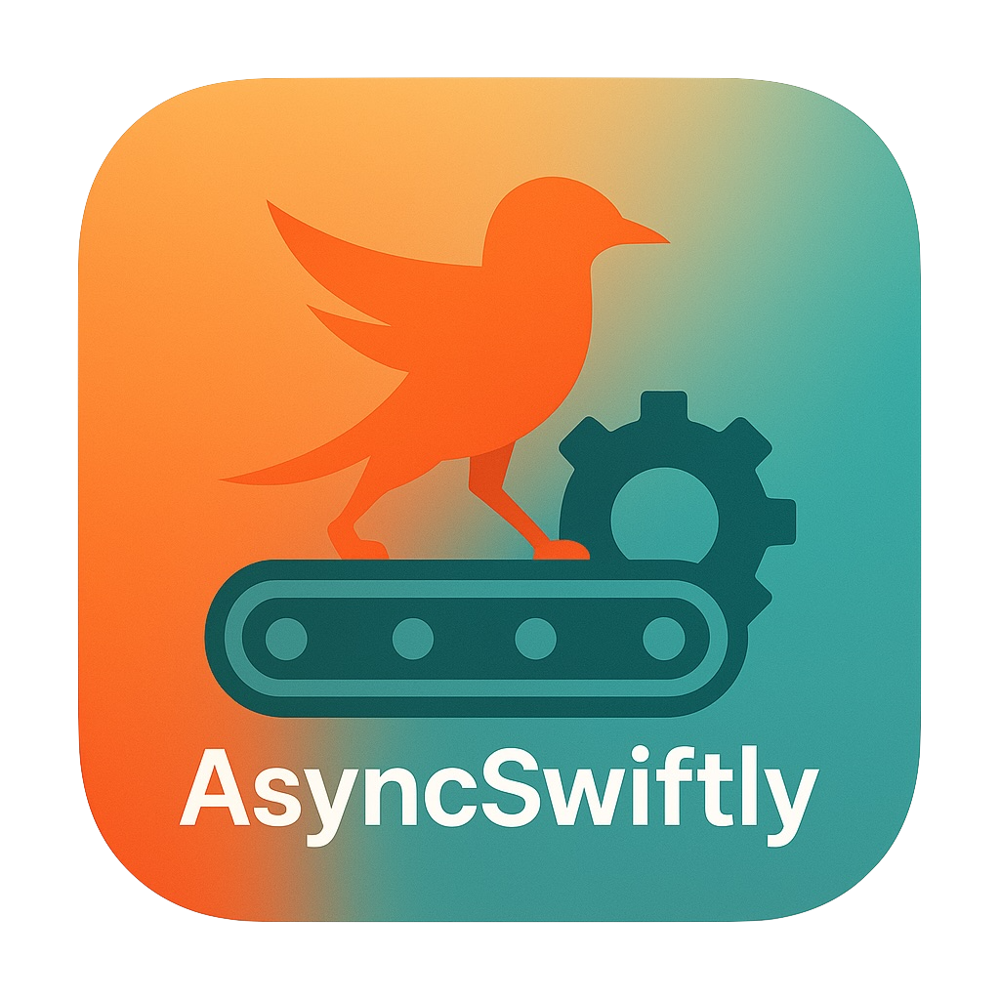

    

Tired of chasing down flaky async tests and spending hours debugging unpredictable failures? What if your asynchronous unit tests could just work—reliably and fast? `AsyncSwiftly` is here to help you stabilize your async testing environment in Swift, so you can spend less time fixing tests and more time building great features.

> [!IMPORTANT]
> This project is in early development and is currently incomplete. Features, APIs, and behavior are subject to change without notice.

## TestingTaskGroup

`TestingTaskGroup` is a deterministic execution environment for Swift Concurrency tests. It uses custom `TaskExecutor` and `SerialExecutor` implementations to route work from the system under test through a controlled work queue, making concurrent jobs observable and executable in a predictable order.

This is useful for tests where correctness depends on the interaction between multiple async tasks, dependencies, suspensions, and resumptions. Instead of relying on wall-clock sleeps or the runtime's default scheduling behavior, tests can schedule tasks at logical steps and let the group drive execution through a manual clock.

The environment is more than just serial execution. It acts as a small scheduler:

- tasks are scheduled at logical time steps;
- jobs produced by those tasks are captured into a work queue;
- work at the same logical step is executed in enqueue order;
- virtual time advances only when there is no immediately runnable work;
- a real timeout can fail tests quickly when work stops making progress.

One of the main challenges in this kind of test environment is distinguishing genuine blocks from short runtime delays. Executors produce jobs dynamically, so an empty queue does not always mean the system is finished or deadlocked. `TestingTaskGroup` keeps track of scheduled work, sleeping operations, running operations, and completion readiness so it can continue driving known work, advance virtual time to the next known wakeup, or rely on the configured timeout when progress cannot be made.

This approach follows the same broad idea used by deterministic async testing tools such as Swift Async Algorithms' `AsyncSequenceValidation`: model concurrent execution as explicit queued work, drain runnable jobs in a stable order, and advance controlled time only when appropriate.
