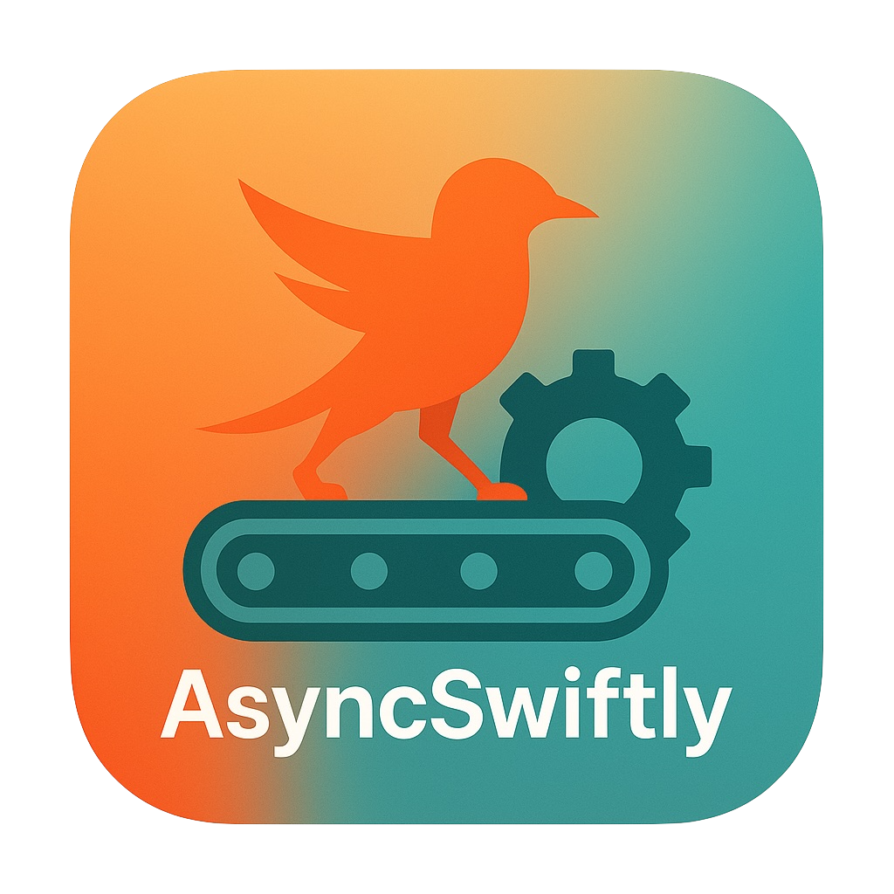

    

Tired of chasing down flaky async tests and spending hours debugging unpredictable failures? What if your asynchronous unit tests could just work—reliably and fast? `AsyncSwiftly` here to help you stabilize your async testing environment in Swift, so you can spend less time fixing tests and more time building great features.
